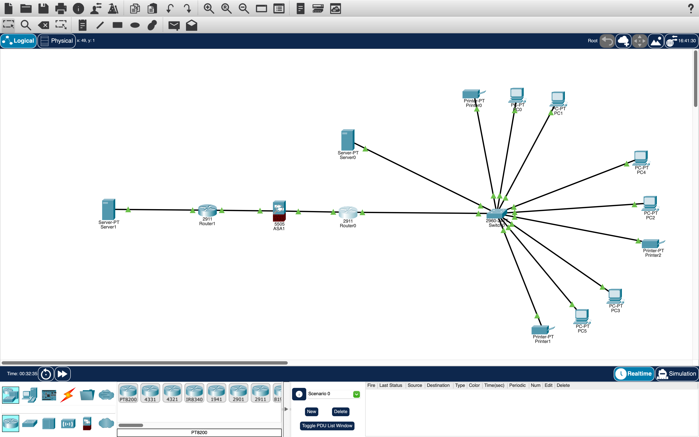
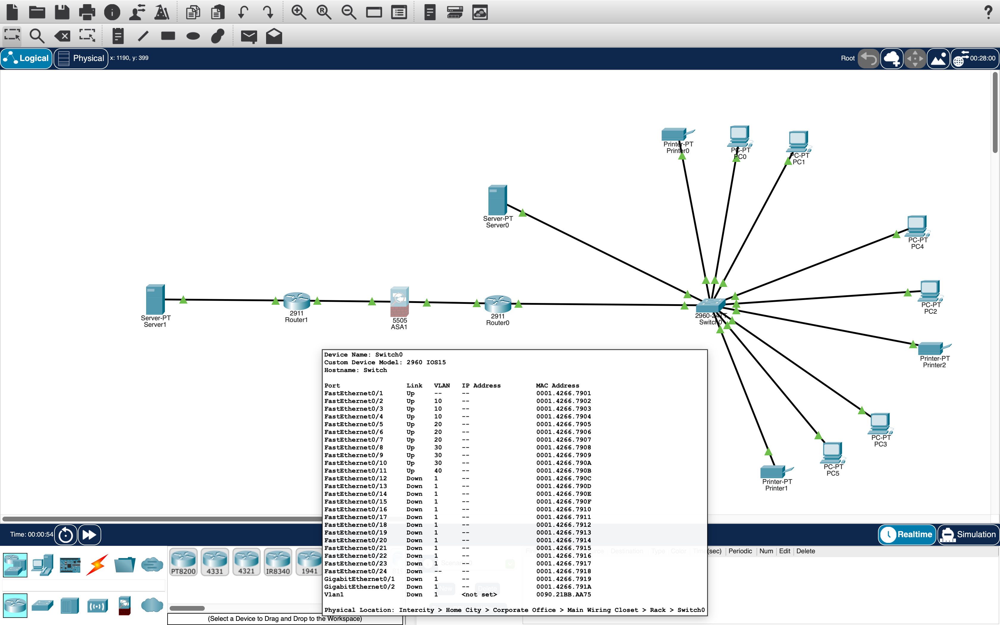
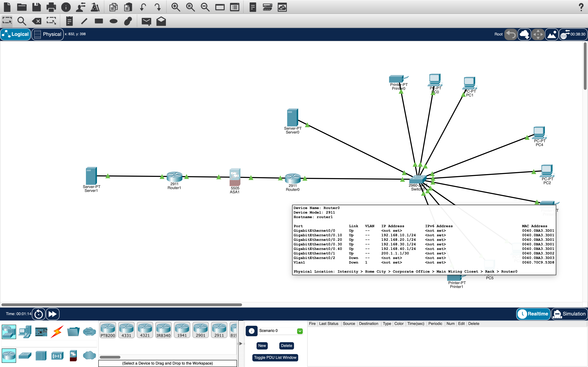
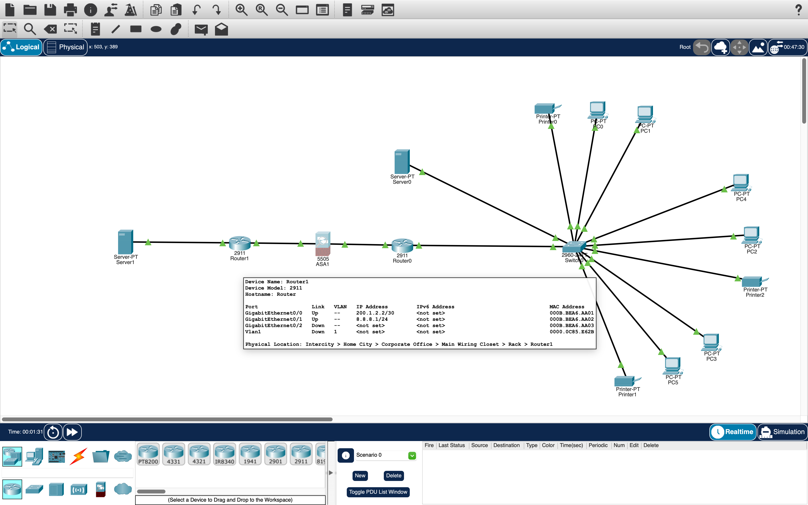
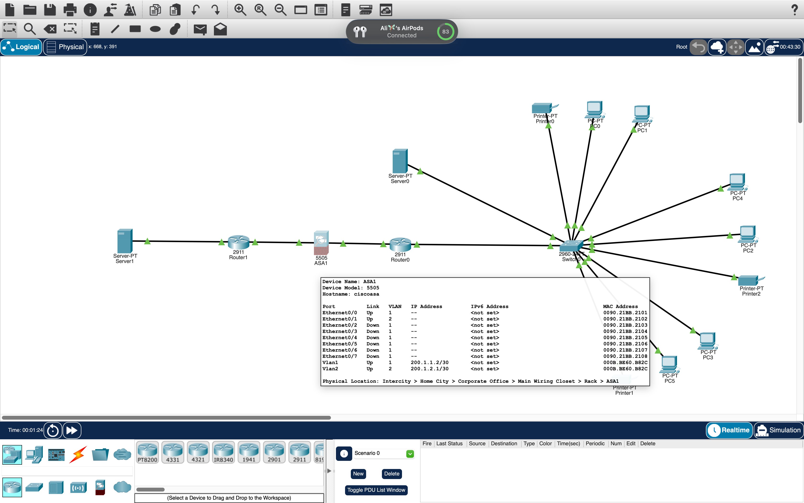
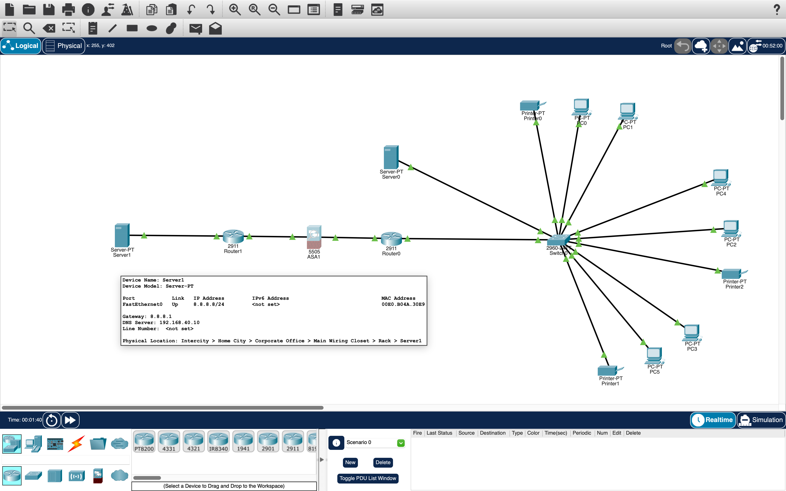
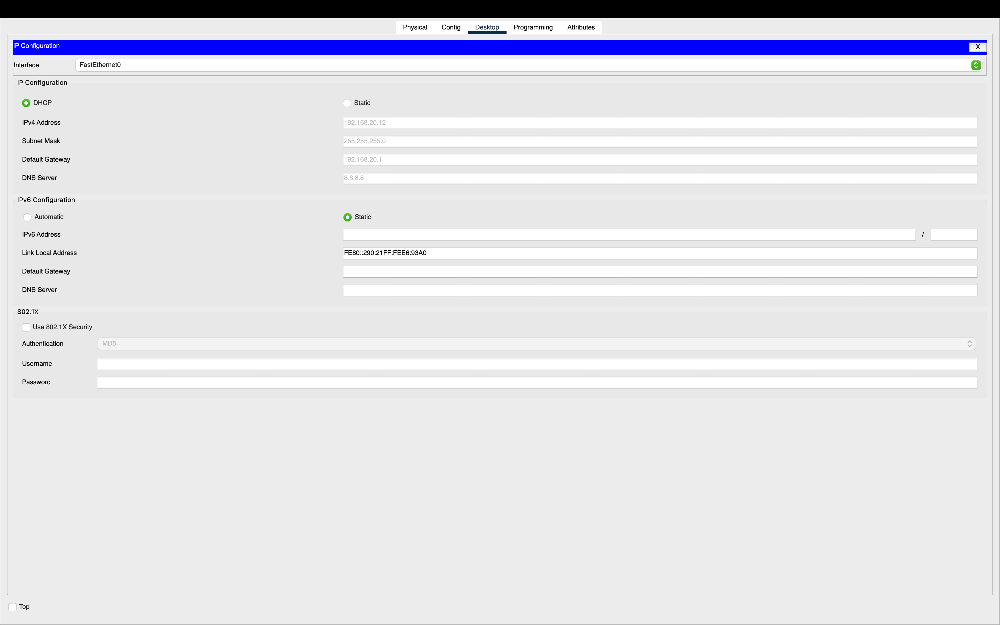
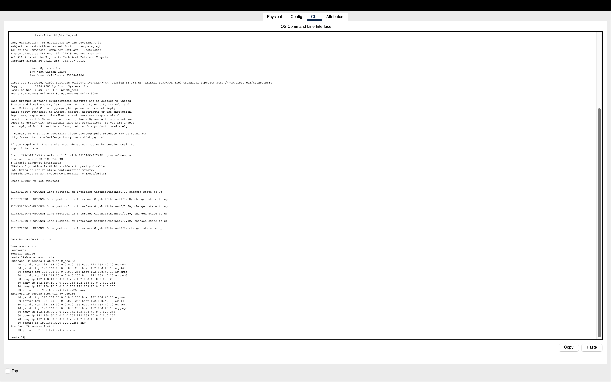
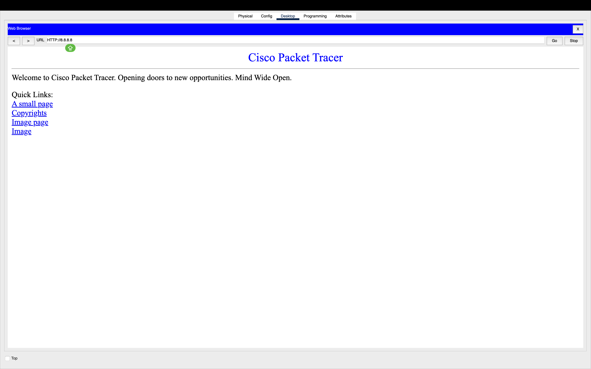

# Enterprise Network Simulation Lab

## Overview
Designed and implemented a multi-VLAN enterprise network in Cisco Packet Tracer to simulate real-world network infrastructure. This project focuses on network segmentation, secure communication, dynamic IP management, and internal service deployment.

The environment integrates routing, firewall security, NAT, access control, and internal services such as DNS, email, and web hosting to reflect a realistic small-to-mid-sized enterprise network.

---

## Network Topology
The network consists of:
- 2 Routers (inter-VLAN routing and external connectivity)
- 1 Layer 2 Switch (VLAN segmentation)
- 1 ASA Firewall (traffic filtering and perimeter security)
- Internal server (DNS, Email, Web services)
- Multiple end devices (PCs and printers)

Departments are separated using VLANs:
- VLAN 10 - Users
- VLAN 20 - IT
- VLAN 30 - Sales
- VLAN 40 - Servers

---

## IP Addressing Scheme
- VLAN 10: 192.168.10.0/24
- VLAN 20: 192.168.20.0/24
- VLAN 30: 192.168.30.0/24
- VLAN 40: 192.168.40.0/24

Each VLAN uses:
- Default Gateway: .1
- DHCP for automatic IP assignment

---

## Technologies Used
- VLAN Configuration (802.1Q)
- Trunking
- Inter-VLAN Routing (Router-on-a-Stick)
- DHCP Configuration
- NAT (Network Address Translation / PAT)
- DNS Configuration
- Email Server Configuration (SMTP/POP3)
- Web Services (HTTP/HTTPS)
- SSH (Secure Remote Management)
- AAA (Authentication, Authorization, Accounting)
- ACLs (Access Control Lists)
- ASA Firewall (Cisco ASA 5505)
- Layer 2 & Layer 3 Routing Concepts

---

## Key Configurations

### Switch Configuration
- Created VLANs to segment departmental traffic
- Assigned access ports to appropriate VLANs
- Configured trunk link between switch and router

### Router Configuration
- Implemented router-on-a-stick using subinterfaces
- Assigned default gateways for each VLAN
- Enabled inter-VLAN routing for controlled communication
- Configured SSH for secure remote device access

### DHCP Configuration
- Created DHCP pools for each VLAN
- Assigned IP ranges, default gateways, and DNS servers
- Excluded reserved IP addresses for infrastructure devices

### NAT Configuration
- Implemented PAT to allow multiple internal hosts to share a single public IP
- Enabled outbound internet access for all VLANs
- Verified NAT translation and connectivity

### DNS Configuration
- Configured internal DNS server for hostname resolution
- Mapped domain names to internal server resources
- Verified successful name resolution from client devices

### Email Configuration
- Configured SMTP and POP3 services
- Created user mailboxes for each department
- Tested internal email communication across VLANs

### Web Services (HTTP/HTTPS)
- Deployed internal web server
- Enabled HTTP and HTTPS services
- Verified client access via browser

### SSH Configuration
- Enabled SSH for secure device management
- Disabled insecure protocols where applicable

### AAA Configuration
- Implemented authentication for administrative access
- Controlled login access to network devices
- Improved accountability and security

### ACL Configuration
- Allowed internet access for internal VLANs
- Restricted access to server VLAN (VLAN 40)
- Controlled inter-VLAN traffic based on role

### Firewall (ASA) Configuration
- Deployed ASA between internal network and external router
- Configured inside and outside interfaces
- Applied traffic filtering for inbound and outbound traffic

---

## Testing & Verification
- Verified DHCP address assignment across all VLANs
- Tested inter-VLAN communication using ICMP (ping)
- Confirmed NAT functionality with external connectivity
- Validated DNS resolution for internal services
- Verified HTTP/HTTPS access to web server
- Tested SMTP/POP3 email communication between users
- Verified SSH access to network devices
- Confirmed ACL enforcement and traffic restrictions

---

## Results
The network successfully provides segmented communication between departments while enforcing security policies. DHCP automates IP assignment, NAT enables internet connectivity, DNS supports internal name resolution, and secure protocols (SSH, AAA, HTTPS) enhance network security and management.

---

## Skills Demonstrated
- Enterprise network design and segmentation
- VLAN and trunking configuration
- Inter-VLAN routing implementation
- DHCP, NAT, DNS, and service configuration
- Email and web service deployment
- Network security (ACLs, firewall, AAA)
- Secure device management (SSH)
- End-to-end troubleshooting across multiple network layers

- ## Screenshots

### Network Topology

### Switch Interface / VLAN Assignment

### Router Interface / Subinterfaces

### ISP Router Interface

### ASA Interface

### Internal Server Interface

### DHCP Client Assignment

### ACL Rules

### Connectivity Test

